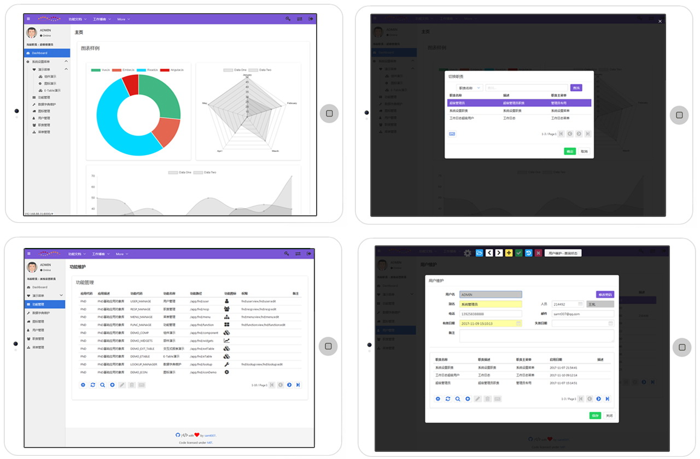
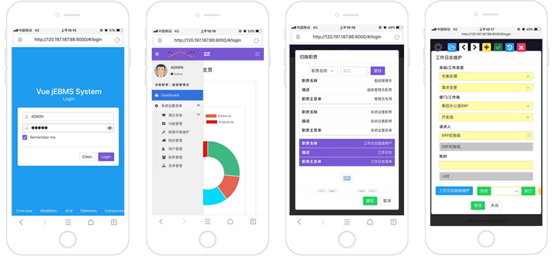

<div align="center">
  <p></p>
  <h1>jebms-admin</h1>
  <b>A Vue.js project</b>
</div>


### Links

- [Documentation](https://samt007.github.io/jebms-ui/documentation)
- [Demo Pending...]()

### System Preview

## Desktop(&ipad)


## Phone


## Tech Stack
前端
- Vue 2.0
- Vue-router
- Vue-resource
- Vue-cli
- ES6
- LocalStorage
- Font-awesome
- [buefy UI (bulma)](https://buefy.github.io)
- [flatpickr](https://chmln.github.io/flatpickr/)
- [vee-validate](https://github.com/baianat/vee-validate)

后端(还在整理代码，暂未开源)：
- Spring,SpringMVC,Spring Boot,Spring Security
- MyBatis
- Redis
- druid 数据库连接池
- swagger 前后端开发的契约工具
- Maven 项目管理工具

## 项目参考
- [vue-admin](https://github.com/vue-bulma/vue-admin): 参考界面的总体布局
- Oracle EBS系统：参考后台架构：功能-->菜单-->职责-->用户

## 项目特点
1. 基础UI基于buefy(bulma)，前端UI完全响应式的，一次编写，3端可用：可供电脑端，平板电脑端以及手机端操作。
2. 从基本功能上，完全实现了Oracle EBS的基础功能配置架构：功能-->菜单-->职责-->用户。
  一个用户可以拥有多个职责。功能权限配置非常灵活。
3. 用vue封装了一个强大的灵活的表格编辑组件(table-editor)。基于它可以很方便开发一个curd的表格，还支持Master-detail这样的经典的表格编辑。
  表格数据编辑的逻辑处理提供了例如preInsert/postInsert等的'触发器'。可以很方便功能的扩展。
4. 提供完整的KeyBoard键盘操作。特别是在编辑数据方便，可以极大提高工作效率。
  例如：表格行切换支持键盘上下换行，左右换页。回车按键快捷弹出编辑数据界面。
5. 按照EBS的多语言的架构，数据库端完全支持多语言。前端的多语言效果待开发。


```
编辑数据的周期函数：
    preClickQuery-->postClickQuery
    preClickInsert-->postClickInsert
    preClickUpdate-->postClickUpdate
    preClickDelete-->postClickDelete
    上面的pre都是在做点击对应的动作之前执行的函数
    上面的post都是在做点击对应的动作之后执行的函数

    preQuery-->postQuery
    preInsert-->postInsert
    preUpdate-->postUpdate
    preDelete-->postDelete
    上面的pre都是在做ajax之前执行的函数
    上面的post都是执行ajax之后执行的函数
    另外，查询的话，是每一笔执行post函数

    whenValidateRecord: 验证表格的数据的有效性的触发器
    whenCreateRecord: 新增数据时候的触发器
    onPopulateDetails: 头-明细的关联触发器
    onOpenDetails: 打开明细框
```

## Build Setup

``` bash
# install dependencies
npm install

# serve with hot reload at localhost:8080
npm run dev

# build for production with minification
npm run build

# build for production and view the bundle analyzer report
npm run build --report
```

For a detailed explanation on how things work, check out the [guide](http://vuejs-templates.github.io/webpack/) and [docs for vue-loader](http://vuejs.github.io/vue-loader).

备注：
有问题的或者需要咨询的可以加群：602017142
或者直接发邮件给我：samt007@qq.com
